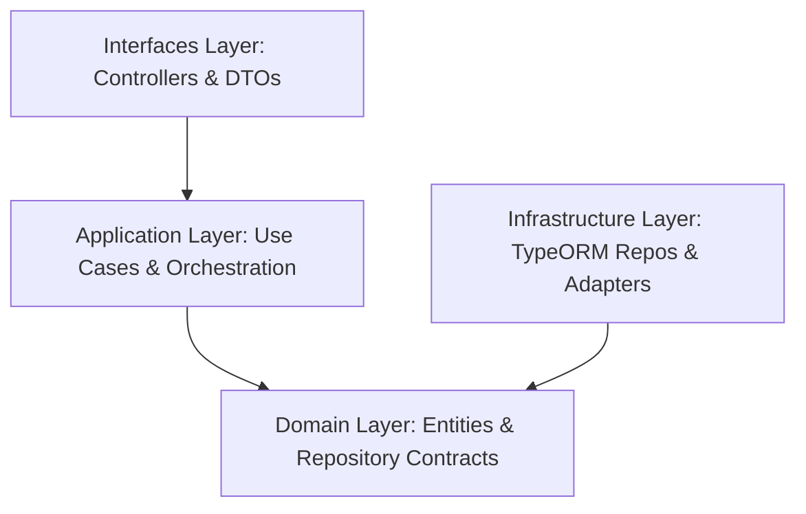

# LinkZ Seat Reservation

A professional seat reservation platform built with NestJS and React, demonstrating senior engineering judgment in architecture, security, and concurrency.

```bash
docker compose up --build
```

Open the application at: `http://localhost:8080`
Interactive API Docs: `http://localhost:3000/api/docs`

## Table of Contents

- [Core Features](#core-business-flow)
- [Architecture & Design](#architecture)
- [Security Model](#security-model)
- [Testing & Quality](#testing-and-verification)
- [Production Hardening](#production-hardening-status)

## Architecture

### System Design
The system follows a strictly decoupled **3-Layer Architecture** (Domain, Application, Infrastructure) to ensure maintainability and database-agnosticism.



| Layer | Responsibility | Key Technologies |
| --- | --- | --- |
| **Interfaces** | REST Controllers, API Documentation, Request Validation | NestJS, Swagger, Class-Validator |
| **Application** | Business Workflows, Transaction Orchestration, External Auth | NestJS Services |
| **Domain** | Core Entities, Data Access Contracts | TypeORM Entities, Interfaces |
| **Infrastructure** | Database Persistence, Security Adapters, Webhook Processing | TypeORM, Argon2, PostgreSQL |

### Persistence Layer
Migrated from raw SQL to **TypeORM** to provide:
- **SQL Injection Mitigation:** Automatic parameterization of all queries.
- **Database Agnosticism:** Repository naming and structure (e.g., `TypeOrmSeatRepository`) allow for easy migration to MySQL, Oracle, or SQL Server.
- **Strong Consistency:** Pessimistic row locking (`FOR UPDATE`) for atomic reservation transactions.

## Security Model

### Authentication & Sessions
- **Opaque Tokens:** Uses random random strings in `HttpOnly` cookies instead of client-accessible JWTs to mitigate XSS risks.
- **Instant Revocation:** Database-backed sessions allow for immediate session invalidation globally.
- **Session Isolation:** Robust state cleanup logic on both backend and frontend ensures no sensitive data leaks between user transitions.

### Request Protection
- **Rate Limiting:** NestJS Throttler protects sensitive endpoints (Login, Payment).
- **Audit Logging:** Comprehensive logging of payment and reservation state changes.
- **Input Validation:** Strict DTO schema enforcement.

## Testing and Verification

### Code Coverage
Achieved **>85% branch coverage** across the entire stack, verified with Jest (Backend) and Vitest (Frontend).

| Module | Line Coverage | Branch Coverage |
| --- | --- | --- |
| **Backend Core** | 90.32% | **85.24%** |
| **Security Services** | 100% | **100%** |
| **Frontend Hooks** | 98.48% | **90%** |

### Verified Scenarios
- Concurrent race conditions for seat reservations (Pessimistic locking test).
- Session logout and state isolation regression tests.
- Full E2E flow from registration to confirmed reservation.

## Production Hardening Status

- [x] **3-Layer Architecture:** Decoupled business logic from persistence.
- [x] **TypeORM Migration:** Secure, type-safe data access with SQLi mitigation.
- [x] **Interactive API Docs:** Swagger/OpenAPI 3.1 enabled.
- [x] **Robust Testing:** >85% coverage with critical path verification.
- [x] **Security Hardening:** Argon2, Session Isolation, and HttpOnly Cookies.

## Final Notes

The primary engineering authority is **PostgreSQL**, providing the transactional consistency required for seat availability. The application is architected to be modular, secure, and ready for future scaling to microservices.
