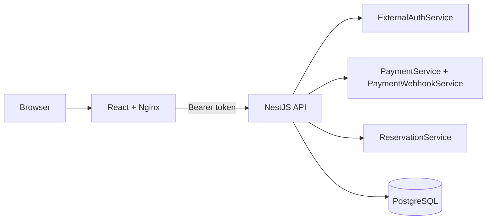

# LinkZ Seat Reservation

Seat reservation demo built with React, NestJS, PostgreSQL, external-provider-ready authentication, and webhook-style payment completion.

```bash
docker compose up --build
```

Open `http://localhost:8080`. Swagger is available at `http://localhost:3000/api/docs`.

## Why Clerk Exists

Clerk is not there because the demo needs a pretty sign-in button. It represents the production identity boundary: passwords, recovery, MFA, social login, account protection, and mobile token issuance should be owned by an identity provider, not by this app.

The backend is provider-neutral after token verification. `ExternalAuthService` verifies a bearer token, maps the external identity into `auth_identities`, and returns an internal `userId`. Reservation and payment logic never depends on Clerk-specific UI.

## Local Multi-User Review

The Docker path intentionally does not require a Clerk tenant. With `AUTH_PROVIDER=mock`, the frontend shows two local identities:

- `Continue as Reviewer A`
- `Continue as Reviewer B`

Use two browsers, two profiles, or one normal window plus one incognito window. Sign in as different reviewers to test separate users, ownership checks, reserved-seat history, and concurrency behavior. These buttons still use the same `Authorization: Bearer mock:...` API shape that Clerk uses with real tokens.

Mock auth is for local review only. Production should set Clerk keys and should not run with `AUTH_PROVIDER=mock`.
Mock mode is strict: bearer values like `abc` are rejected. The token must match `mock:<providerUserId>:<email>:<displayName>`.

## Architecture



## Backend Boundary Design

| Block | Code | Responsibility |
| --- | --- | --- |
| Controllers and DTOs | `backend/src/interfaces` | HTTP routes, validation, Swagger shape |
| Auth boundary | `AuthGuard`, `ExternalAuthService` | Bearer extraction, provider verification, internal user mapping |
| Application services | `backend/src/application` | Payment, webhook, seat, and reservation workflows |
| Repository contracts | `backend/src/domain/repositories.ts` | Database-agnostic persistence contracts |
| Infrastructure | `backend/src/infrastructure` | TypeORM entities, PostgreSQL repositories, schema setup |

## Availability And Security

- PostgreSQL is the source of truth for reservations.
- Reservation completion uses transactions, row locks, and uniqueness constraints to prevent double booking.
- The app does not store local passwords.
- Bearer auth supports web and future mobile clients.
- Payment webhooks are stored before processing, audited, marked failed on transient errors, and retryable through a protected endpoint.
- DTO validation rejects unexpected fields.

Endpoint auth policy:

- Bearer token required: `GET /api/auth/me`, `GET /api/seats`, `GET /api/reservations/me`, `POST /api/payments/create`, `POST /api/payments/:id/complete`, `POST /api/payments/:id/mock-provider-complete`
- Provider signature required: `POST /api/payments/webhook` (`x-mock-signature`)
- Internal token required: `POST /api/payments/webhook/retry-due` (`x-internal-job-token`)

## Payment Failure Handling

Payment completion flows through `PaymentWebhookService`:

1. Store provider event in `payment_webhook_events`.
2. Write receipt/process/failure rows to `payment_audit_logs`.
3. Complete the reservation in a transaction.
4. Mark the event `PROCESSED` on success.
5. Mark the event `FAILED`, increment attempts, and set `next_retry_at` on failure.
6. Retry with `POST /api/payments/webhook/retry-due` and `x-internal-job-token`.

## Commands

```bash
cd backend && npm test && npm run build
cd frontend && npm test && npm run build
docker compose build
```

## Security Changelog

- 2026-05-26: Replaced local password/session model with external-provider bearer auth boundary (`ExternalAuthService` + `AuthGuard`).
- 2026-05-26: Enforced authenticated access on seat listing (`GET /api/seats`) to remove anonymous data access.
- 2026-05-26: Hardened mock-mode auth to reject arbitrary bearer values; only `mock:<providerUserId>:<email>:<displayName>` is accepted.
- 2026-05-26: Added explicit webhook trust boundaries: HMAC signature for provider callback and internal job token for retry endpoint.
- 2026-05-26: Added/updated regression tests for auth guard behavior, malformed mock tokens, webhook processing, and retry failure handling.

## Tradeoffs

- Clerk-ready auth reduces security burden, but real deployments need provider configuration.
- Mock users keep review self-contained, but must be disabled outside local mode.
- PostgreSQL favors correctness over early horizontal write scaling.
- The retry endpoint is enough for this demo; production should use a scheduler or queue-backed worker.
