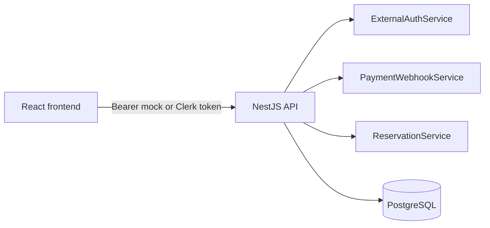

# Backend Guide

NestJS API for LinkZ seat reservations. The backend owns identity mapping, payment attempts, webhook reliability, audit logs, and reservation consistency.

## Setup

```bash
npm install
npm test
npm run build
```

Docker runs the backend with `AUTH_PROVIDER=mock` so reviewers can use multiple local users without Clerk setup.

## Backend Boundary Design

| Boundary | Code | Applied design |
| --- | --- | --- |
| Interface | `interfaces/controllers`, `interfaces/dto`, `AuthGuard` | HTTP routes, DTO validation, bearer-token principal extraction |
| Application | `ExternalAuthService`, `PaymentWebhookService`, `ReservationService` | Provider boundary, webhook retry workflow, critical reservation transaction |
| Domain | `domain/repositories.ts`, `domain/types.ts` | Repository contracts and shared state types |
| Infrastructure | `infrastructure/repositories`, `infrastructure/db/entities` | TypeORM/PostgreSQL persistence implementation |

This keeps migrations contained. Swapping Clerk for Firebase/Auth0 changes the auth adapter. Adding MongoDB or Redis should add adapters/read models, not rewrite reservation business rules.

## Current Local Architecture



Code mapping:

- `ExternalAuthService.authenticateBearerToken` verifies mock/Clerk tokens and upserts `auth_identities`.
- `AuthGuard.canActivate` extracts `Authorization: Bearer ...` and attaches `AuthPrincipal`.
- `PaymentWebhookService` stores, audits, processes, fails, and retries payment webhook events.
- `ReservationService.completeProviderPaymentAndReserve` owns the transactional seat confirmation path.
- `DatabaseService.migrateAndSeed` creates local schema, seed seats, webhook tables, and audit tables.

## Authentication

The backend does not store passwords. In local Docker mode it accepts mock bearer tokens only when `AUTH_PROVIDER=mock`.

Example token shape:

```text
mock:reviewer-a:reviewer.a@example.com:Reviewer A
```

Invalid or malformed mock bearer values (for example `Bearer abc`) are rejected with `401`.

In real deployments, set `CLERK_SECRET_KEY` and use Clerk-issued bearer tokens.

## Endpoint Auth Requirements

- Bearer token required: `GET /auth/me`, `GET /seats`, `GET /reservations/me`, `POST /payments/create`, `POST /payments/:paymentAttemptId/complete`, `POST /payments/:paymentAttemptId/mock-provider-complete`
- Signed provider callback: `POST /payments/webhook` (`x-mock-signature`)
- Internal job auth: `POST /payments/webhook/retry-due` (`x-internal-job-token`)

## Webhook Reliability

Payment provider events are persisted before processing. Failures are marked with `FAILED`, `last_error`, incremented `attempts`, and `next_retry_at`. Due failures can be retried through `POST /payments/webhook/retry-due` with `x-internal-job-token`.

## Verification

```bash
npm test
npm run build
```

Important tests:

- `external-auth.service.spec.ts`
- `auth.guard.spec.ts`
- `payment-webhook.service.spec.ts`
- `reservation.service.spec.ts`

## Tradeoffs

- Mock auth enables local multi-user review, but production must use a real identity provider.
- PostgreSQL is preferred for reservation writes because correctness depends on transactions and constraints.
- Retry is endpoint-driven for the demo; production should use a queue, worker, dead-letter handling, and alerting.
